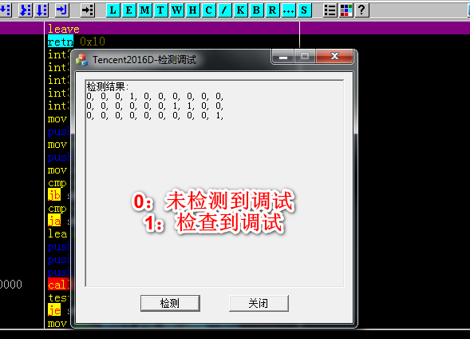
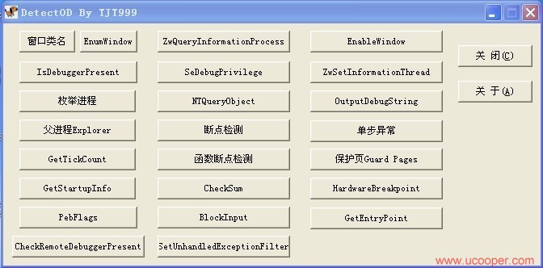

### 反调试技术总结
反调试就是检测有没有被调试器调试，比如OllyDbg，IDA，WinDbg等。

参考资料：[houjingyi ](https://bbs.pediy.com/thread-225735.htm)
 代码： [GitHub](https://github.com/houjingyi233/test-debug)


[Tencent2016D.cpp](./Tencent2016D.cpp) 中实现了30种检测调试器的方法，非常的精彩给力

--
30 Ways to anti-debugging on PC.For more information:http://blog.csdn.net/qq_32400847/article/details/52798050


##### 截图




##### 虚拟机检测

[AntiVirtualMachine](https://github.com/wanttobeno/AntiVirtualMachine)

##### 保护自己的程序不被破解

[DllProtect](https://github.com/wanttobeno/DllProtect)


#####  各种反调试技术原理与实例 VC版

帖子：[各种反调试技术原理与实例 VC版](https://bbs.pediy.com/thread-114767.htm)

[各种反调试技术原理与实例VC版.pdf](./反调试技术实例VC版/各种反调试技术原理与实例VC版.pdf)




```c++
void CDetectODDlg::OnExplorer() 
{
	// TODO: Add your control notification handler code here
	HANDLE hwnd;
	PROCESSENTRY32 tp32;  //结构体
	CString str="Explorer.EXE";

	DWORD ExplorerID;
	DWORD SelfID;
	DWORD SelfParentID;
	SelfID=GetCurrentProcessId();
	::GetWindowThreadProcessId(::FindWindow("Progman",NULL),&ExplorerID);
	hwnd=::CreateToolhelp32Snapshot(TH32CS_SNAPPROCESS,NULL);
	if(INVALID_HANDLE_VALUE!=hwnd) 
	{
		Process32First(hwnd,&tp32);
		do{
			if(0==lstrcmp(str,tp32.szExeFile))
			{
			//	ExplorerID=tp32.th32ProcessID;
			//	AfxMessageBox("aaa");
			}
			if(SelfID==tp32.th32ProcessID)
			{
				SelfParentID=tp32.th32ParentProcessID;
			}
		}while(Process32Next(hwnd,&tp32));

		str.Format("本进程：%d 父进程：%d Explorer进程: %d ",SelfID,SelfParentID,ExplorerID);
		MessageBox(str);
		if(ExplorerID==SelfParentID)
		{
			AfxMessageBox("没有OD");
		}
		else
		{
			AfxMessageBox("发现OD");
		}
	}
	CloseHandle(hwnd);
}

```

